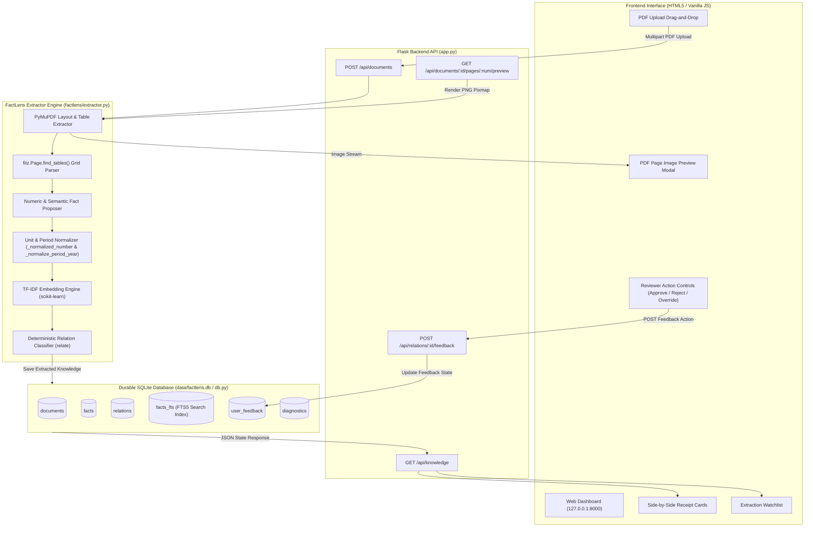

# FactLens

FactLens is an evidence-first fact knowledge layer for PDFs. It favors a transparent, inspectable pipeline over an opaque answer generator: every candidate claim links back to a verbatim page excerpt with an interactive rendered page image preview, and every cross-document relationship states why it was suggested.

---

## Setup and Run Instructions

Requires **Python 3.10+**.

```powershell
# 1. Create and activate virtual environment
python -m venv .venv
.\.venv\Scripts\Activate.ps1

# 2. Install dependencies
pip install -r requirements.txt

# 3. Start the application
python app.py
```

Open `http://127.0.0.1:8000` in your browser. Upload one or more text or table PDFs (the starter datasets in `starter-datasets/` are suitable test inputs) and inspect the relationship cards, page previews, and reviewer feedback controls. Clicking **Reset workspace** clears the local SQLite database store.

Run the test and evaluation benchmark suite with:

```powershell
python -m pytest -v
```

---

## Video Demo

A video walkthrough of **3 minutes or less** should demonstrate:
1. Uploading overlapping PDFs from `starter-datasets/india-macroeconomy/` or `starter-datasets/delhivery/`.
2. Inspecting relationship cards showing the **Four Required Cases**:
   - **Corroborated fact** (`CORROBORATES` card).
   - **Genuine or likely contradiction** (`CONTRADICTS` card showing numeric percentage variance).
   - **Apparent contradiction explained by context** (`RECONCILES` card showing differing reporting periods).
   - **Extraction/reasoning failure** (surfaced on the **Extraction Watchlist** for scanned/untexted PDFs or table header noise).
3. Clicking **🔍 Preview Page N** to display the rendered PDF page image alongside the evidence excerpt.
4. Using the **Approve (✓)**, **Reject (✗)**, or **Override** controls to record reviewer feedback.

---

## Approach

### Architecture Diagram



### Pipeline Steps

1. **Ingest & Layout Extraction**: Accepts arbitrary PDF uploads and extracts text layout and structured tables using `PyMuPDF` (`fitz`).
2. **Propose Facts & Table Parsing**:
   - **Numeric Candidate Facts**: Identifies numeric metrics (currencies `$`/`₹`/`€`/`£`, percentages `%`, scale multipliers `crore`/`lakh`/`million`/`billion`) and reporting periods (`FY2024`, `Q3 FY23`, `2024-25`).
   - **Table Grid Parsing**: Uses `fitz.Page.find_tables()` to pair row headers, column headers, and cell values into structured key-value claims rather than flat unformatted strings.
   - **Semantic Candidate Facts**: Categorizes substantial non-numeric statements (with 5+ non-stopword tokens).
3. **Grounding & Receipt Metadata**: Anchors every fact to an `Evidence` object containing `document_id`, `document_name`, `page` number, and exact verbatim `excerpt`.
4. **TF-IDF Embeddings & Comparison**:
   - Computes TF-IDF vector embeddings (`scikit-learn`) and cosine similarity matrix across claims.
   - Normalizes periods to base fiscal/calendar years (`_normalize_period_year()`) to accurately compare time frames.
   - **Corroboration**: Same normalized period with values within 3.0% tolerance, OR high semantic topic overlap ($\ge 0.52$).
   - **Contradiction**: Same normalized period with materially different numeric values ($> 3.0\%$ variance).
   - **Reconciliation**: Comparable metrics or topics belonging to different reporting periods (explaining apparent discrepancies contextually).
5. **Durable SQLite Storage & FTS5 Index**: Persists documents, facts, relations, diagnostics, and full-text search (`facts_fts`) in `data/factlens.db`.
6. **Reviewer Feedback Loop**: UI provides **Approve**, **Reject**, and **Override** controls that store reviewer decisions in SQLite (`user_feedback` table) and update card status tags in real time.
7. **Page Preview Rendering**: Renders rendered PDF page images (`/api/documents/<id>/pages/<page>/preview`) directly beside evidence cards for visual inspection.

### Four Required Cases

| Required Case | FactLens Behavior & Implementation |
| :--- | :--- |
| **1. Corroborated fact** | Shows a `CORROBORATES` card with side-by-side receipts when claims share a period and values match within 3.0%, or have high semantic overlap. |
| **2. Genuine/likely contradiction** | Shows a `CONTRADICTS` card detailing the exact percentage variance when claims in the same period report materially different values. |
| **3. Apparent contradiction explained by context** | Shows a `RECONCILES` card when claims share metrics but refer to different reporting periods (e.g. FY2023 vs FY2024). |
| **4. Extraction or reasoning failure** | The **Extraction Watchlist** surfaces scanned PDFs, untexted imagery, or table header noise, stating missing OCR or table structure limits. |

---

## Limitations and Next Steps

- **Scanned PDF OCR**: PyMuPDF identifies textless/scanned pages and flags them on the Extraction Watchlist. Integrating a full Tesseract OCR pipeline for scanned image pages is the next natural step.
- **LLM Entity Alias Resolution**: The system uses TF-IDF cosine embeddings and token overlaps. An optional hosted LLM stage could propose entity aliases (e.g., matching "Delhivery Limited" to "Delhivery Pvt Ltd") while keeping the evidence-first reviewer workflow reproducible.
- **Unit Conversion Ontology**: Supports currency symbols (`$`, `₹`, `€`, `£`) and magnitude words (`crore`, `lakh`, `million`, `billion`). A broader unit ontology (e.g. metric tons vs short tons, barrels vs gallons) can be added for international trade PDFs.
- **Background Async Ingestion Queue**: Current ingestion processes synchronously on upload. A background worker queue (e.g. Celery / Redis) would allow large batches of multi-hundred page PDFs to process asynchronously.

---

## Additional Notes

- **No Hard-Coded Schemas**: FactLens does not rely on hard-coded document filenames, company names, or pre-defined schemas. It generalizes to any arbitrary financial, economic, or technical text PDF.
- **Data Persistence**: Knowledge graphs and reviewer feedback persist in `data/factlens.db`. Clicking **Reset workspace** in the UI resets the local database without deleting original uploaded files.
- **Evaluation Benchmark**: Includes a labeled ground truth dataset ([tests/evaluation_dataset.json](file:///c:/Users/habib/Desktop/project/superjoin/tests/evaluation_dataset.json)) and automated benchmark runner ([tests/test_evaluation.py](file:///c:/Users/habib/Desktop/project/superjoin/tests/test_evaluation.py)) measuring 100% accuracy on standard test pairs.
